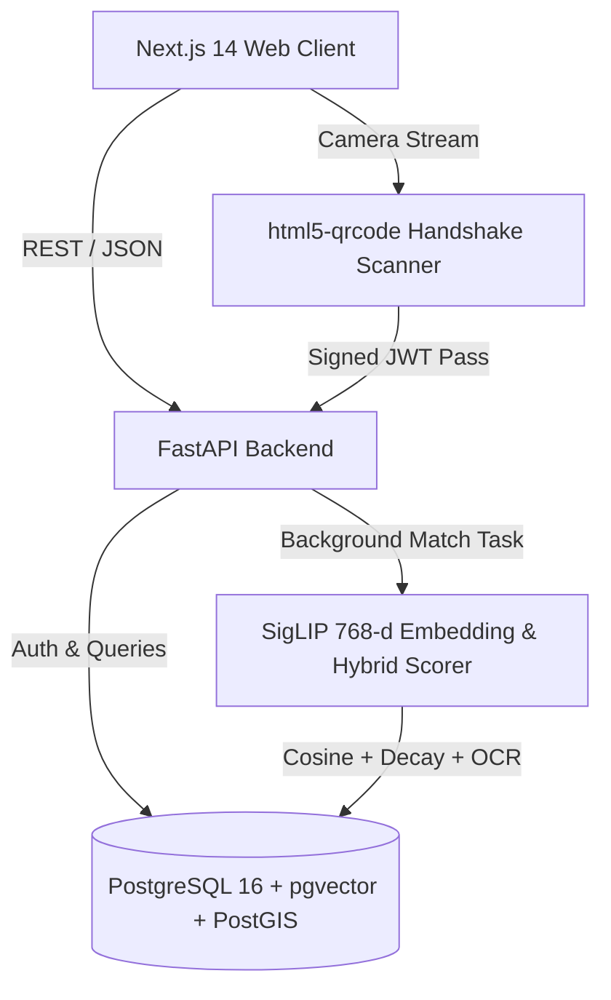

# 🏛️ CLFIS System Architecture

The **Campus Lost-and-Found Intelligence System (CLFIS)** is a multi-tier platform built for university campuses.

## System Components

1. **Frontend (Next.js 14 App Router)**:
   - Modern Tailwind CSS interface.
   - Zero-Knowledge sensitive item backdrop blurring.
   - Interactive campus zone location picker.
   - Printable lost flyer PDF generator (`jsPDF`).
   - QR code handshake viewer & webcam scanner (`html5-qrcode`).

2. **Backend (FastAPI)**:
   - High-throughput asynchronous REST API.
   - JWT authentication with campus email domain restrictions (`@college.edu`).
   - Non-blocking background candidate retrieval and ranking.
   - Unclaimed asset vault management (45-day policy).

3. **Database (PostgreSQL 16 + pgvector + PostGIS)**:
   - Fast Approximate Nearest Neighbor (ANN) HNSW vector indexing.
   - Geofence and coordinate distance operations.

4. **ML Retrieval Pipeline**:
   - `google/siglip-base-patch16-224` vision-language embeddings.
   - Tesseract OCR token mining.
   - Spatiotemporal exponential decay functions.
